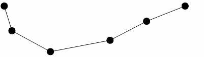
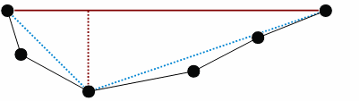
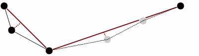
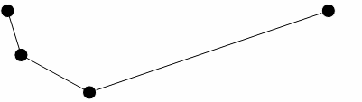
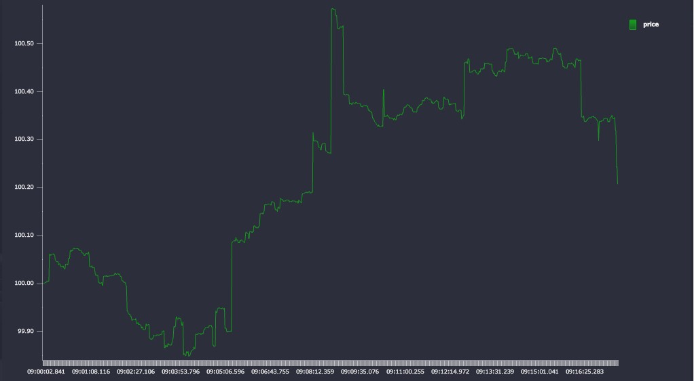
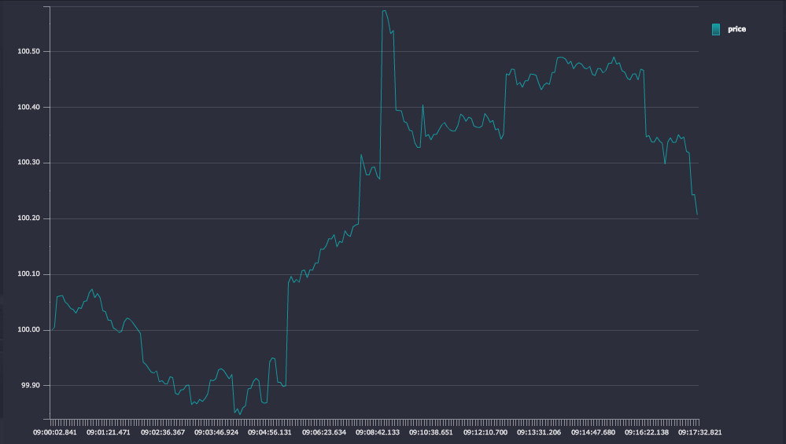
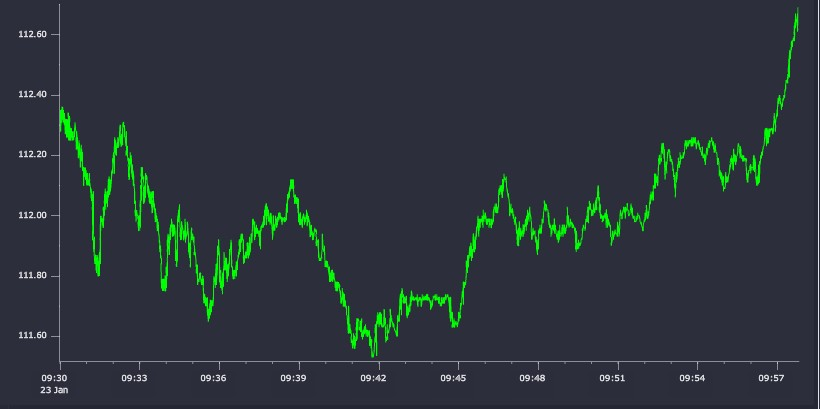
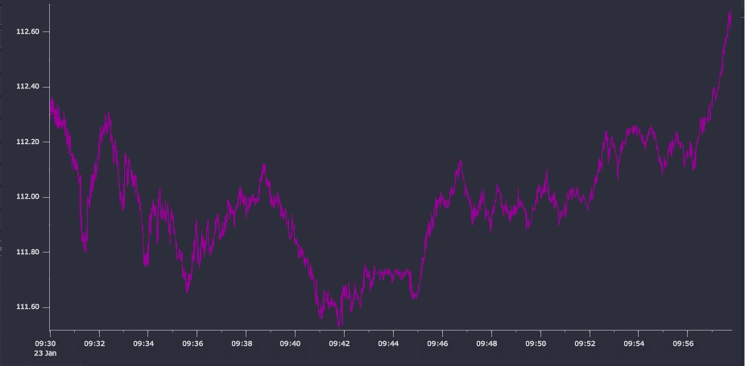

White paper
{: #wp-brand}

# Dynamically shrinking big data using time-series database kdb+

by [Sean Keevey &amp; Kevin Smyth](#author)
{: .wp-author}


The widespread adoption of algorithmic trading technology in financial markets combined with ongoing advances in complex event processing has led to an explosion in the amount of data which must be consumed by market participants on a real-time basis. Such large quantities of data are important to get a complete picture of market dynamics; however they pose significant capacity-challenges for data consumers. While specialized technologies such as kdb+ are able to capture these large data volumes, downstream systems which are expected to consume this data can become swamped.

It is often the case that when dataset visualizations are focused on trends or spikes occurring across relatively longer time periods, a full tick-by-tick account is not desired; in these circumstances it can be of benefit to apply a simplification algorithm to reduce the dataset to a more manageable size while retaining the key events and movements.

This paper will explore a way to dynamically simplify financial time series within kdb+ in preparation for export and consumption by downstream systems. We envisage the following use cases, among potentially many others:

-   GUI rendering – This is particularly relevant for Web GUIs which typically use client-side rendering. Transferring a large time series across limited bandwidth and rendering a graph is typically a very slow operation; a big performance gain can be achieved if the dataset can be reduced prior to transfer/rendering.

-   Export to spreadsheet applications – Powerful as they are, spreadsheets are not designed for handling large-scale datasets and can quickly grind to a halt if an attempt is made to import and conduct analysis.

-   Reduced storage space – Storing smaller datasets will result in faster data retrieval and management.

Key to our approach is avoiding distortion in either the time or the
value domain, which are inevitable with bucketed summaries of data.

All tests were performed using kdb+ version 3.2 (2015.01.08).


## Background

The typical way to produce summaries of data sets in kdb+ is by using bucketed aggregates. Typically these aggregates are applied across time slices.


### Bucketing

Bucketing involves summarizing data by taking aggregates over time windows. This results in a loss of a significant amount of resolution.

```q
select avg 0.5 * bid + ask by 00:01:00.000000000 xbar time from quote where sym=`ABC
```

The `avg` function has the effect of attenuating peaks and troughs, features which can be of particular interest for analysis in certain applications.

A common form of bucket-based analysis involves taking the open, high, low and close (OHLC) price from buckets. These are plotted typically on a candlestick or line chart.

```q
 select o:first price, h:max price, l:min price, c:last price 
   by 00:01:00.000000000 xbar time from trade where sym=`ABC
```

OHLC conveys a lot more information about intra-bucket price movements than a single bucketed aggregate, and will preserve the magnitude of significant peaks and troughs in the value domain, but inevitably distorts the time domain – all price movements in a time interval are summarized in 4 values for that interval.


### A new approach

The application of line and polygon simplification has a long history in the fields of cartography, robotics and geospatial data analysis. Simplification algorithms work to remove redundant or unnecessary data points from the input dataset by calculating and retaining prominent features. They retain resolution where it is required to preserve shape but aggressively remove points where they will not have a material impact on the curve, thus preserving the original peaks, troughs, slopes and trends resulting in minimal impact on visual perceptual quality.

Time-series data arising from capital-market exchanges often involve a proliferation of numbers that are clustered closely together on a point-by-point basis but form very definite trends across longer time horizons; as such they are excellent candidates for simplification algorithms.

Throughout the following sections we will use the method devised by (Ramer, 1972) and (Douglas & Peucker, 1973) to conduct our line-simplification analysis. In a survey (McMaster, 1986), this method was ranked as mathematically superior to other common methods based upon dissimilarity measurements and considered to be the best at choosing critical points and yielding the best perceptual representations of the original lines. The discriminate smoothing that results from these methods can massively reduce the complexity of a curve while retaining key features which, in a financial context, would typically consist of price jumps or very short-term price movements, which would be elided or distorted by alternative methods of summarizing the data.

In the original work, the authors describe a method for reducing the number of points required to represent a polyline. A typical input to the process is the ordered set of points below.



<small>_Figure 1_</small>

The first and last points in the line segment form a straight line; we begin by calculating the perpendicular distances from this line to all intervening points in the segment. Where none of the perpendicular distances exceed a user-specified tolerance, the straight-line segment is deemed suitable to represent the entire line segment and the intervening points are discarded. If this condition is not met, the point with the greatest perpendicular distance from the straight line segment is selected as a break point and new straight-line segments are then drawn from the original end points to this break point.



<small>_Figure 2_</small>

The perpendicular distances to the intervening points are then recalculated and the tolerance conditions reapplied. In our example the gray points identified below are deemed to be less than the tolerance value and are discarded.



<small>_Figure 3_</small>

The process continues with the line segment being continually subdivided and intermediate points from each sub-segment being discarded upon each iteration. At the end of this process, points left over are connected to form a simplified line.



<small>_Figure 4_</small>

If the user specifies a low tolerance this will result in very little detail being removed whereas if a high tolerance value is specified this results in all but the most general features of the line being removed.

The Ramer-Douglas-Peucker method may be described as a recursive divide-and-conquer algorithm whereby a line is divided into smaller pieces and processed. Recursive algorithms are subject to stack-overflow problems with large datasets and so in our analysis we present both the original recursive version of the algorithm as well as an iterative, non-recursive version which provides a more robust and stable method.


## Implementation

We initially present the original recursive implementation of the
algorithm, for simplicity, as it is easier understood.

### Recursive implementation

```q
// perpendicular distance from point to line
pDist:{[x1;y1;x2;y2;x;y]
  slope:(y2 - y1)%x2 - x1;
  intercept:y1 - slope * x1;
  abs ((slope * x) - y - intercept)%sqrt 1f + slope xexp 2f }

rdpRecur:{[tolerance;x;y]
  // Perpendicular distance from each point to the line
  d:pDist[first x;first y;last x;last y;x;y];
  // Find furthest point from line
  ind:first where d = max d;
  $[tolerance < d ind;
    // Distance is greater than threshold => split and repeat
    .z.s[tolerance;(ind + 1)#x;(ind + 1)#y],' 1 _/:.z.s[tolerance;ind _ x;ind _ y];
    // else return first and last points 
    (first[x],last[x];first[y],last[y])] }
```

It is easy to demonstrate that a recursive implementation in kdb+ is
prone to throw a stack error for sufficiently jagged lines with a low
input tolerance. For example, given a triangle wave function as
follows:

```q
q)triangle:sums 1,5000#-2 2
q)// Tolerance is less than distance between each point, 
q)// would expect the input itself to be returned
q)rdpRecur[0.5;til count triangle;triangle]
'stack
```

Due to this limitation, the algorithm can be rewritten to be iterative rather than recursive, opting for an approach which uses the kdb+ function `over` to keep track of the call stack and achieve the same result.


### Iterative implementation

Within the recursive version of the Ramer-Douglas-Peucker algorithm the subsections that have yet to be analyzed and the corresponding data points which have been chosen to remain are tracked implicitly and are handled in turn when the call stack is unwound within kdb+. To circumvent the issue of internal stack limits the iterative version explicitly tracks the subsections requiring analysis and the data points that have been removed. This carries a performance penalty compared to the recursive implementation.

```q
rdpIter:{[tolerance;x;y]
  // Boolean list tracks data points to keep after each step
  remPoints:count[x]#1b;

  // Dictionary to track subsections that require analysis
  // Begin with the input itself
  subSections:enlist[0]!enlist count[x]-1;

  // Pass the initial state into the iteration procedure which will 
  // keep track of the remaining data points 
  res:iter[tolerance;;x;y]/[(subSections;remPoints)];

  // Apply the remaining indexes to the initial curve
  (x;y)@\:where res[1] }

iter:{[tolerance;tracker;x;y]
  // Tracker is a pair, the dictionary of subsections and 
  // the list of chosen datapoints
  subSections:tracker[0];
  remPoints:tracker[1];

  // Return if no subsections left to analyze
  if[not count subSections;:tracker];

  // Pop the first pair of points off the subsection dictionary 
  sIdx:first key subSections;
  eIdx:first value subSections;
  subSections:1_subSections;

  // Use the start and end indexes to determine the subsections 
  subX:x@sIdx+til 1+eIdx-sIdx;
  subY:y@sIdx+til 1+eIdx-sIdx;

  // Calculate perpendicular distances
  d:pDist[first subX;first subY;last subX;last subY;subX;subY]; 
  ind:first where d = max d;
  $[tolerance < d ind;

    // Perpendicular distance is greater than tolerance 
    // => split and append to the subsection dictionary
    [subSections[sIdx]:sIdx+ind;subSections[sIdx+ind]:eIdx];

    // else discard intermediate points
    remPoints:@[remPoints;1+sIdx+til eIdx-sIdx+1;:;0b]]; 

  (subSections;remPoints) }
```

Taking the previous `triangle` wave function example once again, it may be demonstrated that the iterative version of the algorithm is not similarly bound by the maximum internal stack size:

```q
q)triangle:sums 1,5000#-2 2
q)res:rdpIter[0.5;til count triangle;triangle]
q)res[1]~triangle
1b
```


## Results


### Cauchy random walk

We initially apply our algorithms to a random price series simulated by sampling from the Cauchy distribution which will provide a highly erratic and volatile test case. Our data sample is derived as follows:

```q
PI:acos -1f

// Cauchy distribution simulator
rcauchy:{[n;loc;scale]loc + scale * tan PI * (n?1.0) - 0.5}

// Number of data points
n:20000

// Trade table with Cauchy distributed price series
trade:([] time:09:00:00.000+asc 20000?(15:00:00.000-09:00:00.000);
          sym:`AAA;
          price:abs 100f + sums rcauchy[20000;0.0;0.001] )
```

The initial price chart is plotted below using [KX Dashboards](../../devtools.md#kx-dashboards).



<small>_Figure 5_</small>

For our initial test run we choose a tolerance value of 0.005. This is the threshold for the algorithm – where all points on a line segment are less distant than this value, they will be discarded. The tolerance value should be chosen relative to the typical values and movements in the price series.

```q
// Apply the recursive version of the algorithm
q)\ts trade_recur:exec flip `time`price!rdpRecur[0.005;time;price] from trade
53 1776400

// Apply the iterative version of the algorithm
q)\ts trade_iter:exec flip `time`price!rdpIter[0.005;time;price] from trade
141 1476352
q)trade_recur ~ trade_iter
1b
q)count trade_simp
4770
```

The simplification algorithm has reduced the dataset from 20,000 to 4,770, a reduction of 76%. The modified chart is plotted.



<small>_Figure 6_</small>


### Apple Inc. share price

Applying the algorithms to a financial time-series dataset, we take some sample trade data for Apple Inc. (AAPL.N) for a period following market-open on January 23, 2015. In total the dataset contains ten thousand data points, spanning about 7 minutes. The raw price series is plotted in Figure 7.

Again, we use the functions defined above to reduce the number of data-points which must be transferred to the front end and rendered. In terms of financial asset-price data, the input tolerance roughly corresponds to a tick-size threshold below which any price movements will be discarded.

A tolerance value of 0.01 – corresponding to 1 cent – results in a 58% reduction in the number of data points with a relatively small runtime cost (&lt;180ms for the recursive version, &lt;600ms for the iterative version). The result, plotted in Figure 8, compares very favorably with the plot of the raw data. There are almost no perceivable visual differences.



<small>_Figure 7_</small>



<small>_Figure 8_</small>

Finally we simplify the data using a tolerance value of 0.05 – 5 cents. This results in a 97% reduction in the number of data points with a very low runtime cost (18ms for recursive version, 38ms for the iterative version) as the algorithm is able to very quickly discard large amounts of data. However, as can be seen in Figure 9, there is a clear loss of fidelity though the general trend of the series is maintained. Many of the smaller price movements are lost – ultimately the user’s choice of a tolerance value must be sensitive to the underlying data and the general time horizon across which the data will be displayed.


<small>_Figure 9_</small>


## Conclusion

In this paper we have presented two implementations of the Ramer-Douglas-Peucker algorithm for curve simplification, applying them to financial time-series data and demonstrating that a reduction in the size of the dataset to make it more manageable does not need to involve data distortion and a corresponding loss of information about its overall trends and key features.

This type of data-reduction trades off an increased runtime cost on the server against a potentially large reduction in processing time on the receiving client.

While for many utilities simple bucket-based summaries are more than adequate and undeniably more performant, we propose that for some uses a more discerning simplification as discussed above can prove invaluable. This is particularly the case with certain time-series and combinations thereof where complex and volatile behaviors must be studied.

[:fontawesome-solid-print: PDF](/download/wp/time_series_simplification_in_kdb_a_method_for_dynamically_shrinking_big_data.pdf)


## Authors

**Sean Keevey** is a kdb+ consultant and has developed data and analytic systems for some of the world's largest financial institutions. Sean is currently based in London developing a wide range of tailored analytic, reporting and data solutions in a major investment bank.

Other papers by Sean Keevey
{: .publications}

<ul markdown="1" class="publications">
-   :fontawesome-regular-map: [Dynamically shrinking big data using timeseries database kdb+](../ts-shrink/index.md)
</ul>

**Kevin Smyth** has worked as a kdb+ consultant for some of the world’s leading exchanges and financial institutions. Based in London, Kevin has experience with data capture and high-frequency data-analysis projects across a range of asset classes.


## References

Douglas, D., & Peucker, T. (1973). Algorithms for the reduction of the number of points required to represent a digitized line or its caricature. _The Canadian Cartographer_ 10(2), 112–122.

McMaster, R. B. (1986). A statistical analysis of mathematical measures for linear simplification. _The American Cartographer_ 13(2), 113-116.

Ramer, U. (1972). An iterative procedure for the polygonal approximation of plane curves. _Computer Graphics and Image Processing_ 1(3), 244-256.


