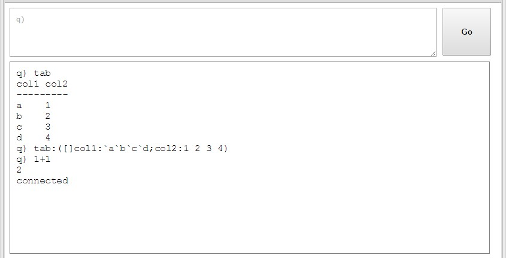
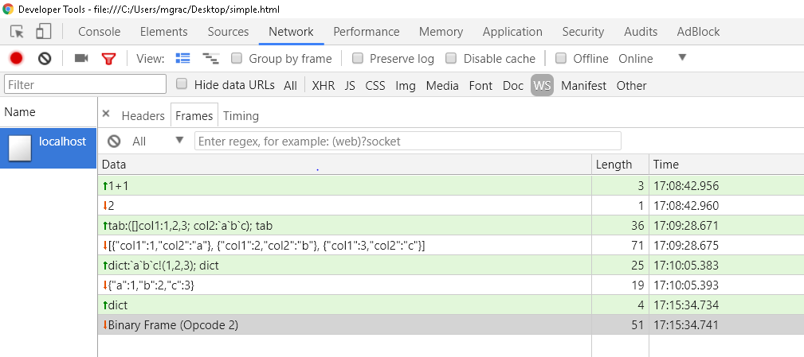
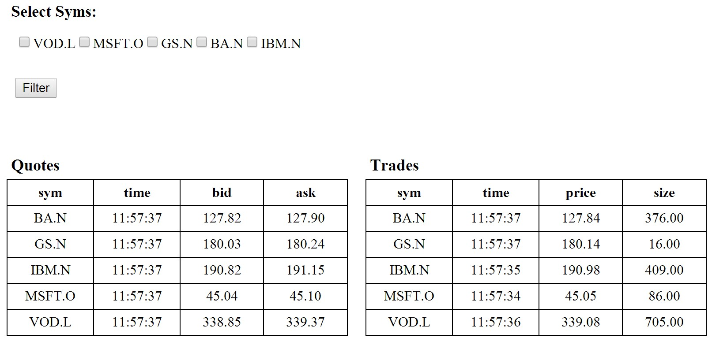

White paper
{: #wp-brand}

# Kdb+ and WebSockets 

by [Chris Scott &amp; Michael Gracey](#authors)
{: .wp-author}


Since the release of kdb+ 3.0, it has been possible to make use of
[WebSockets](https://en.wikipedia.org/wiki/WebSocket "Wikipedia") when connecting to a kdb+ process. This has significant
implications for how we can build front-end applications that use a kdb+
back-end, in particular for applications wanting to display real-time
information.

WebSockets are supported by most modern browsers and thus make it
possible to hook a web application up directly to a kdb+ process to
allow real-time communication over a persistent connection. This gives
us the ability to build a pure HTML5 real-time web application which can
connect to kdb+ through JavaScript, which is native to web browsers.

Using web applications to build GUIs for kdb+ applications is becoming
increasingly popular. Only a web browser is required to run the GUI, so
it is OS independent. This means that when developing the GUI, only one
codebase is required for all platforms and maintenance and upgrades are
much easier and efficient to perform.

This paper introduces what WebSockets are and what benefits they hold
over standard HTTP. It takes the reader through the set-up of a simple
web page that uses WebSockets to connect to a kdb+ process, the steps
involved in passing data through the connection, and the various methods
for converting data between kdb+ and JavaScript.

An earlier version of this paper was published in October 2014. Kdb+ has been enhanced since then to support the growing popularity of WebSockets and JSON. As part of
this revision, the paper now also documents new message handlers for
opening and closing WebSocket connections, and debugging
techniques that can be used to view traffic over these connections.

The paper finishes with a full working example (including
code) of a simple Web application which uses kdb+ to provide real-time
updating of tables based on user queries.

!!! tip "HTML, CSS and JavaScript"

    As well as q, this paper makes significant use of HTML, CSS and JavaScript. A basic understanding of these will be necessary to take full advantage of this paper, though any complex structures will be examined here in detail. For a crash course on the above languages, please refer to the following resources:

    -   [w3schools.com](https://www.w3schools.com)
    -   [codecademy.com ](https://www.codecademy.com)


## What are WebSockets?

WebSockets were a long-awaited evolution in client and web server
communication technology. They provide a protocol between a client and
server which runs over a persistent TCP connection. The client-server
connection can be kept open as long as needed and can be closed by
either the client or the server. This open connection allows
bi-directional, full-duplex messages to be sent over the single TCP
socket connection – the connection allows data transfer in both
directions, and both client and server can send messages simultaneously.
All messages sent across a WebSocket connection are asynchronous.

Without WebSockets, bi-directional messaging can be forced by having
distinct HTTP calls for both the client sending requests and the server
publishing the responses and updates. This requires either the client to
keep a mapping between outgoing and incoming messages, or the use of a
proxy server in between the client and server (known as HTTP tunneling).
WebSockets simplify this communication by providing a single connection
which both client and server can send messages across.

WebSockets were designed to be implemented in web browsers and web
servers, but they can be used by any client or server application. The
ability for bi-directional real-time functionality means it provides a
basis for creating real-time applications on both web and mobile
platforms. The WebSocket API and Protocol have both been standardized by
W3C and the IEFT respectively.


### Why not just use `.z.ph`?

It has previously been possible to connect to a kdb+ process using HTTP.
HTTP requests could be processed using the `.z.ph` and `.z.pp` handlers. To
illustrate this, simply start up a q process with an open port and then
type the hostname:port into your web browser. This will give a very
basic view of the q process.

Straight out of the box, this is very simple and provides a useful
interface for viewing data and running basic queries without being
limited to the character limits of a q console. If, however, you want to
do more than just simple analysis on the q process, this method presents
a few drawbacks:

1.  Customization is quite a complicated process that requires you to
    manipulate the functions in the `.h` namespace which form the basis of
    the in-built HTTP server code. The HTML markup is generated entirely
    by the q process.

2.  Data must be requested by the browser, so some form of polling must
    occur in order to update the webpage. This makes the viewing of
    real-time data impossible without the continuous polling of the kdb+
    server.

3.  `.z.ph` uses synchronous messaging, and the webpage is effectively
    refreshed every time a query is sent.

Instead of relying on `.z.ph` to serve the entire web page, an application
could make use of AJAX techniques to send asynchronous GET and POST
requests to a kdb+ server. `.z.ph` and `.z.pp` can be modified to handle
these requests. AJAX (Asynchronous JavaScript And XML) is a descriptive
name that covers a range of web development techniques that can be used
to provide asynchronous messaging between a web application and server.

This allows requests to be made by the client in the background without
having to reload the web page, and as there is no reliance on `.z.ph` to
generate the HTML markup, the application can be fully customized
independently of the kdb+ process. In order to receive updates, the
application will still have to poll the server, which is not ideal for
real-time data. The full implementation of this method is beyond the
scope of this white paper.

As WebSocket connections are persistent, the server is able to push
updates to the client rather than relying on the client to poll for the
information. Additionally, while each HTTP request and response must
include a TCP header, WebSockets only require this header to be sent
during the initial handshake.


## Connecting to kdb+ using WebSockets 

### The handshake 

In order to initialize a WebSocket connection, a WebSocket ‘handshake’
must be successfully made between the client and server processes.
First, the client sends a HTTP request to the server to upgrade from the
HTTP protocol to the WebSocket protocol:
```http
// Client WebSocket request header</p>
GET /text HTTP/1.1
Host: localhost:5001
Upgrade: websocket
Connection: Upgrade
Sec-WebSocket-Key: xc0DPEL132mlMtGdbWJPGQ==
Sec-WebSocket-Version: 13
```
The server then sends a HTTP response indicating that the protocol
upgrade was successful:
```http
// Server WebSocket response header
HTTP/1.1 101 Switching Protocols
Upgrade: websocket
Connection: Upgrade
Sec-WebSocket-Accept: 1thgMROs9ylOWOMkc2WUWGRzWdY=
```
The above handshake request and response details can be found within a
browser’s dev tools. Google Chrome’s developer tools can be opened with the
F12 key and any information on a pages network operations can found
within its _Network_ tab. Here you can click on _WS_ to filter out just the
WebSocket connections and then select a specific WebSocket connection to
see a headers section detailing its request and response headers and
perhaps, more importantly, see a _Frames_ section which can be used to
monitor traffic sent over the connection in real time. We will revisit
the _Frames_ section later.

<br/>
<small>_The Network tab in Chrome Developer Tools_</small>


### `.z.ws` message handler

Like the `.z.ph` HTTP GET handler, kdb+ has a separate message handler for
WebSockets called `.z.ws`, meaning all incoming WebSocket messages will be
processed by this function. There is no default definition of `.z.ws`; it
should be customized by the developer to handle the incoming messages as
required. Later, several examples of a customized `.z.ws` handler will be
shown, but initially, we will look at a very basic definition:
```q
q).z.ws:{neg[.z.w].Q.s value x;}
```
For now, let’s assume that `x` (the query from the client) is being passed
in as a string. `value x` simply evaluates the query, and passing this
into `.Q.s` will present the result in console output format (i.e. plain
text).

As mentioned before, all messages passed through a WebSocket connection
are asynchronous. This means that we must handle the server response
within the `.z.ws` message handler. `neg[.z.w]` does this by
asynchronously pushing the results back to the handle which raised the
request.

From the server side, using `neg[.z.w]` within the handler will push the
result back to the client once it has been evaluated. The client does
not wait for a response and instead the open WebSocket connection will
receive the response some time later, so we must handle this on the
client side as well.

Fortunately, JavaScript has a native WebSocket API which allows us to
handle this relatively easily. The main parts of the JavaScript API are
explained below.
```html
<script type="text/javascript">
    function connect(){
        if ("WebSocket" in window){ // check if WebSockets supported
            // open a WebSocket
            var ws = new WebSocket("ws://host:port");
            ws.onopen = function(){
                // called upon successful WebSocket connection
            };
            ws.onmessage = function(msg){
                // called when the client receives a message
            };
            ws.onclose = function(){
                // called when WebSocket is closed
            };
        }
        else {
            // the browser doesn't support WebSockets
        }
    }
    ws.send(msg) // function to handle sending a message
</script>
```


### `.z.wo` and `.z.wc` message handlers

The `.z.wo` and `.z.wc` message handlers were introduced in kdb+ version 3.3
(2014.11.26) to be evaluated whenever a WebSocket connection is opened
(`.z.wo`) or closed (`.z.wc`). Prior to this version, `.z.pc` and `.z.po`
provide an alternative solution however, these handle the opening and
closing of all connections over a port and don’t distinguish WebSocket
connections.

The `.z.wo` handler, much like its `.z.po` counterpart, is called when the
connection is initialized and after it has been validated against any
`-u`/`-U` and/or `.z.pw` checks in place. Neither `.z.wo` nor `.z.wc` has a
default definition, so they should be customized by the developer
accordingly. Typical usage of these handlers is to maintain information
on active WebSocket connections as demonstrated below:
```q
q)\p 5001
q)activeWSConnections: ([] handle:(); connectTime:())

//x argument supplied to .z.wc & .z.wo is the connection handle
q).z.wo:{`activeWSConnections upsert (x;.z.t)}
q).z.wc:{ delete from `activeWSConnections where handle =x}

//websocket connects
q)activeWSConnections
handle connectTime
-------------------
548 13:15:24.737

//websocket disconnects
q)activeWSConnections
handle connectTime
------------------
```


### Simple example

Here is an example of a simple client application connecting to a kdb+
server using a WebSocket. This is a slightly modified version of the
example in the Knowledge Base [WebSocket article](../../kb/websockets.md).

First, start up a kdb+ server and set our `.z.ws` handler. Here we will
also add some error trapping to the handler to send any error message to
the client.
```q
q)\p 5001
q).z.ws:{neg[.z.w].Q.s @[value;x;{`$ "'",x}]}
```
Next, we create an HTML document that we will use to connect to our kdb+
server. The code for creating this is given in Appendix A and should be
copied into a text editor and saved as an HTML file, which can then
be read in any modern web browser.

In our HTML code, we define the elements that will capture input and
display output, apply some basic stylings to those elements and supply
the JavaScript that will send our input to the server and handle the
response it gets back. This web application will function like a q
console in that we can write some q commands in its input box, send that
input as a string to the server by clicking a button and then see the
returned result produced by the server evaluating those input commands.

<br/>
<small>_A web console application which allows q commands to be executed from the browser_</small>


### Pushing data to the client using `neg[h]`

Above, we have used `neg[.z.w]` within the `.z.ws` handler to return the
result to the client immediately after it is received and evaluated. But
in some situations, we don’t want to just provide a response, but rather
set up a subscription that continually pushes data through our WebSocket
connection.

As the WebSocket is persistent and obeys normal IPC protocol, we can
push data through it asynchronously at any time using `neg[h]`, where `h`
is the WebSocket handle. To see this, in the input box of the example
application above, type the following code and click _Go_.
```q
q).z.ts:{[x;y]neg[x].Q.s .z.T}[.z.w]; system"t 1000"
```
You should now see the current time being output every second, without
the browser having to poll for the data.


## Converting kdb+ to JSON

Converting kdb+ into string format using `.Q.s` means that not only is the
message limited by the console size, but also that, as the client is
receiving plain text, the data will be unstructured and very difficult
to parse into something that can be manipulated by the client.

JavaScript has a built-in technology called JSON (JavaScript Object
Notation) which can be used to create JavaScript objects in memory to
store data. These objects are collections of name/value pairs which can
be easily accessed by JavaScript and used to build the data structures
displayed on the web page.

We want to make use of JSON to hold our data so that we can easily
display and manipulate our data on the client. There is a very important
relationship between kdb+ and JSON – kdb+ dictionaries and JSON objects
are comparable. This means that we can parse our kdb+ data into JSON
structures very easily, with tables just becoming arrays of JSON
objects.

Depending on the application, it may be of benefit to do this conversion
on the server side within the q process, or on the client-side in the
JavaScript code. We will explore the two options along with an example
to show both in action.


### Using `.j` functions within a q process (server-side parsing)

Kdb+ 3.3 introduced native functions for translating between kdb+ and
JSON format. This resulted in a 50-100× speedup compared to previous
functionality, and the new versions can also process Unicode.

There are two main functions that we will make use of:

-   `.j.j` parses kdb+ into a JSON string
-   `.j.k` parses a JSON string into kdb+

```q
q)tab:([]col1:`a`b`c`d;col2:1 2 3 4)
q)tab 
col1 col2 
--------- 
a    1
b    2
c    3
d    4
q).j.j tab
"[{\"col1\":\"a\",\"col2\":1},{\"col1\":\"b\",\"col2\":2},{\"col1\":\"c\",\"c..
q).j.k "{\"a\":1,\"b\":2,\"c\":3,\"d\":4}"
a| 1
b| 2
c| 3
d| 4
```
Here is an example of how we can use this to manipulate data in our web
app. First set up our server and use `.j.j` to convert the kdb+ output to
JSON:
```q
q)\p 5001
q).z.ws:{neg[.z.w].j.j @[value;x;{`$ "'",x}];}
```
[Above](#zws-message-handler) we used the `SimpleDemo.html` file given in [Appendix A](#a-simpledemohtml), which includes some code to handle a plain-text response and append it to the screen:
```js
/* 
    when a message is received, prepend the message to the display area 
    along with the input command 
*/
ws.onmessage=function(e){
    /* 
        the message is in plain text, so we need to convert ' ' to '&nbsp;' 
        and '\n' to '<br />' in order to display spaces and newlines correctly 
        within the HTML markup
    */
    var formattedResponse = e.data.replace(/ /g, '&nbsp').replace(/\n/g, '<br />');
    output.innerHTML = cmd + formattedResponse + output.innerHTML;
    cmd="";
}
```
We can now rewrite the `ws.onmessage` JavaScript function from this
example to handle the messages coming through as JSON strings rather
than just plain text.
```js
ws.onmessage=function(e){
    /*parse the JSON string into a JSON object using JSON.parse */
    var outputHTML,data = JSON.parse(e.data);
    if (typeof data == "object") {
        /* if an object, then message must be a table or a dictionary */
        if (data.length) {
            /*if object has a length then it is a table*/
            outputHTML = generateTableHTML(data);
        } else {
            /* 
                if object has no length, it is a dictionary, 
                in this case we will iterate over the keys to print 
                the key|value pairs as would be displayed in a q console
            */
            for (var x in data)
                outputHTML += x + " | " + data[x] + "<br />";
        }
    } else {
        /* if not an object, then message must have simple data structure*/
        outputHTML = data;
    };
    output.innerHTML = cmd + outputHTML + "<br />" + output.innerHTML;
}
```
Whenever we handle a table in this example you will notice we call a
function named `generateHTML`. This is a simple function we wrote to
loop over each object in the array of objects that we now know
represents a table and wrap each inner value in HTML table markup. This
is in a separate function because we will reuse this functionality later
and having it in a separate function makes it easier to copy and reuse
in other applications.
```js
function generateTableHTML(data){
    /* we will iterate through the object wrapping it in the HTML table tags */
    var tableHTML = '<table border="1"><tr>';
    for (var x in data[0]) {
        /* loop through the keys to create the table headers */
        tableHTML += '<th>' + x + '</th>';
    }
    tableHTML += '</tr>';
    for (var i = 0; i < data.length; i++) {
        /* loop through the rows, putting tags around each col value */
        tableHTML += '<tr>';
        for (var x in data[0]) {
            tableHTML += '<td>' + data[i][x] + '</td>';
        }
        tableHTML += '</tr>';
    }
    tableHTML += '</table>';
    return tableHTML;
}
```
With our improvements in place, you can see that it gives the same web
console application as before. The distinction, however, is that we are
now handling JSON objects which are easier to manipulate than strings of
plain text. The JavaScript code will now be aware of data type
information which is not the case with plain strings and could use that
information to perform more complex operations like filtering data or
populating charts.

Using the `.j` functions within the q process is very straightforward, and
if it is suitable for the application to transfer messages across the
WebSocket as strings, this can be a good solution. However, in some
cases, it may be preferable to serialize the data into binary format
before transmitting it across the connection.


### Using `c.js` within JavaScript (client-side parsing) 

Instead of parsing the data within the kdb+ server using `.j` functions,
we could instead use `-8!` to serialize the data into kdb+ binary form
and then deserialize it on the client side directly into a JSON object.
With client machines generally being a lot more powerful than in the
past, it is reasonable to provide the client-side JavaScript code with
some extra workload.

This approach requires a little more understanding of JavaScript.
However, KX provides the script `c.js` which contains the functionality to
serialize and deserialize data on the client side. The `deserialize`
function converts kdb+ binary data into JSON, while the `serialize`
function will convert our message into kdb+ binary format before sending
it to the server. `c.js` can be found on GitHub at:
:fontawesome-brands-github: [KxSystems/kdb/c/c.js](https://github.com/KxSystems/kdb/blob/master/c/c.js)

The previous section showed how we can parse q structures into JSON strings and
send them to our client. In this example, we will instead do all of the
parsing on the client side to produce the same result. The client will
send strings to the server, but the server will send serialized data
back to the client. Outgoing messages are serialized using the `-8!`
operator:
```q
q)\p 5001
q).z.ws:{neg[.z.w] -8! @[value;x;{`$"'",x}]}
```
We need to make a few adjustments to our JavaScript code in order to handle the serialized responses. Firstly, we need to
load the `c.js` script into our web page by downloading the `c.js` file to
the same directory as our HTML document, and include the below import
just before our main set of `<script>` tags.
```html
<script src="c.js"></script>
```
When we define our WebSocket connection, we need to tell the JavaScript
code to expect the messages to be coming through in binary. For this we
set `ws.binaryType` to `'arraybuffer'`.
Place this line on the line after we have set up the new WebSocket connection.
```js
ws = new WebSocket("ws://localhost:5001/");
ws.binaryType = 'arraybuffer';
```
Next, we need to edit the `ws.onmessage` function. As we are deserializing
the message straight into JSON, we do not need to use the `JSON.parse`
function. Instead, we simply replace it with the `deserialize` function
provided in `c.js`.
```js
var outputHTML,data = deserialize(e.data);
```
The rest of `ws.onmessage` should be identical to the example in the previous section and should work exactly as it did before. We could also decide we
want to serialize the message that we send to the server from the client
using the `serialize` function.
```js
ws.send(serialize(input.value)); 
```
This would then require that we update `.z.ws` to deserialize the message
back into a string using `-9!` so that it can then be evaluated.
```q
q).z.ws:{neg[.z.w] -8! @[value;-9!x;{`$ "'",x}]} 
```

:fontawesome-solid-book-open: 
[Interprocess communication](../../basics/ipc.md) 
<br>
:fontawesome-solid-graduation-cap: 
[Serialization examples](../../kb/serialization.md)


## Viewing traffic over a WebSocket connection

When working with WebSockets sometimes we may need to view the messages
that are being sent over a WebSocket connection for debugging purposes.
We can do this by inspecting the _Network_ tab in our browser’s developer tools.
We are going to use Google Chrome for the demonstration of this, but
most modern browsers will also implement similar network-monitoring
tools.

In [The handshake](#the-handshake), we looked at the headers associated with a WebSocket
connection. Beside the _Headers_ section, there is a _Frames_ tab that
displays what messages have been sent and received, the time they
happened, and how many characters long those messages were. The figure
below shows us the traffic conducted while using our earlier web console
application.

<br/>
<small>_The sent and received messages over a connection as displayed in Google Chrome’s Network tab_</small>

You can see above that the messages in green are query strings that we
are sending to the server and the messages in white are the JSON strings
we are getting back. The last line shows us a different response from
the server. At this point, the `.z.ws` message handler was modified
slightly. Instead of using `.j.j` before sending back the data, it was
changed to serialize it using `-8!` instead. The binary frame that we see
is simply the serialized response we are getting back. It is important
to note when sending serialized data we cannot view the message again
until it has been received and deserialized.


## WebSocket security 

Security is one of the biggest concerns in any system. It is of the
utmost importance that, especially when dealing with sensitive financial
information, users only have access to view and edit data they are
allowed to see.

The methods used to protect kdb+ processes can be extended to cover
WebSockets. There is one caveat in terms of username/password
authentication which we will discuss below. A full discussion on kdb+
permissioning is beyond the scope of this white paper; instead, please
refer to the [July 2013 white paper](../permissions/index.md).


### Username and password 

Client authentication is not defined in the WebSocket protocol, and in
most cases, it is up to the developer to implement an authentication
method of their choice. This means that being prompted for a username
and password by the browser when the WebSocket makes a request cannot be
guaranteed across all browsers, Chrome and Firefox do support this,
however.

First, create our user/password file and start the server using the `–u`
argument.
```dos
C:\Users\mgrac&gt;type users.txt chris:password
michael:password2
C:\Users\mgrac&gt;q -p 5001 –u users.txt
KDB+ 3.5 2017.11.30 Copyright (C) 1993-2017 Kx Systems
w32/ 4()core 4095MB mgrac desktop-u7p1jte 192.168.1.64 NONEXPIRE
```
```q
q).z.ws:{neg[.z.w] -8! @[value;-9!x;{`$ "'",x}]}
```
If we try to connect to the process using Chrome or Firefox, they will
prompt for a username and password and, upon correct entry, successfully
create the connection. Not all browsers will currently ask for
authentication details, and if so their connection attempt will not be
successful. When the connection is not successful due to authentication,
a response code of 401 (unauthorized) will be returned to the client.

Behind the scenes, Chrome/Firefox are actually sending two requests.
When they each receive the first 401 response code, they prompt for a
username and password and then send a new WebSocket request with an
additional ‘Authorization’ option in the header.

As mentioned [above](#zws-message-handler), all WebSocket messages will be processed by
the `.z.ws` handler. To fully secure a kdb+ system, this handler should be
locked down in the same manner as the `.z.pg`, `.z.ps`, `.z.ph` and `.z.pp`
handlers.

As of kdb+ 3.4 we can use
Secure Sockets Layer (SSL)/Transport Layer Security (TLS) to encrypt
connections using OpenSSL. This process will secure any WebSocket server
and upgrade its connection protocols to `wss://` and `https://`
respectively. 

:fontawesome-solid-graduation-cap: 
[Secure sockets stunnel](../../kb/websockets.md#secure-sockets-stunnel)


## A simple example – real-time data 

This section will present a simple example in which some tables will be
updated in the browser in real-time.

The full code can be found in Appendix A along with start-up
instructions in order to get the example working. Some of the key
features will be explained here. Once the example is successfully
running you should be able to see the following tables in your browser
continuously updating:

<br/>
<small>_The web page shows the last quote and trade values for
each symbol, and gives the user the ability to filter the syms
in view_</small>

The idea behind the pubsub mechanism here is that a client will make
subscriptions to specific functions and provide parameters that they
should be executed with. The subscription messages we send to the server
will be sent as query strings so our `.z.ws` message handler is defined to
simply evaluate them.
```q
q).z.ws:{value x}
```
Next, we initialize the trade and quote tables and `upd` function to mimic
a simple Real-Time Subscriber, along with a further table called `subs`,
which we will use to keep track of subscriptions.
```q
// subs table to keep track of current subscriptions
q)subs:2!flip `handle`func`params`curData!"is**"$\:()
```
The `subs` table will store the handle, function name and function
parameters for each client. As we only want to send updates to a
subscriber when something has changed, we store the current data held by
each subscriber so that we can compare against it later.

The functions that can be called and subscribed to by clients through
the WebSocket should be defined as necessary. In this example, we have
defined a simple function that will return a list of distinct syms that
will be used to generate the filter checkboxes on the client and
additional functions to display the last record for each sym in both the
trade and quote tables. The aforementioned trade and quote table
functions will also accept an argument by which to filter the data if it
is present.
```q
//subscribe to something
sub:{`subs upsert(.z.w;x;enlist y)}
//publish data according to subs table
pub:{
  row:(0!subs)[x];
  (neg row[`handle]) .j.j (value row[`func])[row[`params]]
  }
// trigger refresh every 1000ms
.z.ts:{pub each til count subs}
\t 1000
```
The subfunction will handle new subscriptions by upserting the handle,
function name and function parameters into the `subs` table. `.z.wc` will
handle removing subscriptions from the table whenever a connection is
dropped.

The `pub` function is responsible for publishing data to the client. It
takes an argument that refers to a row index in the `subs` table and uses
it to get the subscriptions function, the parameters to use when calling
that function and the handle that it will use in sending the result to
the client. Before doing so, it will also use `.j.j` to parse the result
into a JSON string. The client can then parse the JSON into a JavaScript
object upon arrival as it did in the earlier example. The `pub` function
itself will be called on a timer every second for each row in the `subs`
table.

One thing that is important to be consider whenever using
WebSockets is that the JavaScript `onmessage` function needs a way in
which to identify different responses from one another. Each different
response could have a different data structure that will need to be
handled differently. Perhaps some data should be used in populating
charts while other data for updating a table. If an identifier is
present, it can be used to ensure each response is handled accordingly.
In this example, the responses `func` value acts as our identifier. We can
look at the `func` value and from that determine which function should be
called in order to handle the associated data.
```js
ws.onmessage = function(e) {
    /*parse message from JSON String into Object*/
    var d = JSON.parse(e.data);
    /*
        depending on the messages func value, 
        pass the result to the appropriate handler function
    */
    switch(d.func){
        case 'getSyms'   : setSyms(d.result);   break;
        case 'getQuotes' : setQuotes(d.result); break;
        case 'getTrades' : setTrades(d.result);
    }
};
```
The rest of the JavaScript code for the client has been seen in previous
examples. The tables that update in the browser are simply being redrawn
every time the client receives a new response for the appropriate table.

The end result is a simplistic, interactive, real-time web application
showing the latest trade and quote data for a range of symbols. Its
intention is to help readers understand the basic concepts of kdb+ and
WebSocket integration.


## Conclusion 

This white paper has shown how WebSockets can be used as part of a HTML5
GUI to connect to a q process and allow persistent, real-time
communication between kdb+ and a web browser.

There are different methods for sending messages over the connection, and
we have seen how to parse kdb+ data into JSON objects using both
server-side and client-side methods. Both of these methods have their
benefits and drawbacks so it is important to consider the application
infrastructure when deciding which method will be most suitable.
Serialising data across the connection is easy to achieve using the `-8!`
and `-9!` functions on the kdb+ server and the `c.js` code provided by KX
on the JavaScript client. Alternatively, the kdb+ `.j.j` and `.j.k`
functions can be used in conjunction with a browser’s native JSON parser
to achieve the same result.

:fontawesome-solid-chart-line: 
:fontawesome-solid-chart-pie: 
:fontawesome-solid-chart-bar: 
:fontawesome-solid-chart-area: 
<br>
[_Kx Dashboards_](/dashboards/)
provides a range of great ways to visualize and analyze
both real-time streaming data and highly-optimized polled queries on
intra-day and historical data. Completely configurable, _Kx Dashboards_ enables clients to quickly build powerful grids and charts of the
underlying data stored within KX and other databases. 

All tests were run using kdb+ version 3.5 (2017.11.30)

[:fontawesome-solid-print: PDF](/download/wp/websockets-us.pdf)


## Authors

<!-- Version 1.0 -->
**Chris Scott** worked for First Derivatives from 2013 as a kdb+ consultant at one of the world’s largest financial institutions, developing a range of kdb+ applications which use WebSockets as a form of communication.

<!-- **Version 1.1 (March 2018)** -->
**Michael Gracey** also joined First Derivatives in 2013 and works as a front-end developer for one of the world’s largest financial institutions developing a performant Web interface for visualising real-time data via the use of WebSocket connections. Michael is also involved in designing HTML5 training courses and building HTML5 mobile and desktop applications for the KX platform.


## Appendixes 

The following code is also available on GitHub at
:fontawesome-brands-github: 
[kxcontrib/websocket](https://github.com/kxcontrib/websocket).


### A. `SimpleDemo.html`

```html
<!doctype html>
<html>
<head>
    <title>WebSocket Demo</title>
    <style>
        /* define some CSS styling on page elements */
        #txtInput {width: 85%; height: 60px; float:left; padding: 10px;}
        #cmdInput {margin-left: 10px; width:10%; height:80px; font-weight: bold;}
        #txtOutput {
            width: 96%; height: 300px; font-family: "Courier New"; padding: 10px; 
            border: 1px solid gray; margin-top: 10px; overflow:auto;
        }
    </style>
</head>
<body>
    <textarea id="txtInput" placeholder="q)"></textarea>
    <button id="cmdInput" onclick="send();">Go</button>
    <div id="txtOutput"></div>
</body>
<script>
    var ws, cmd = "";
    var input=document.getElementById("txtInput");
    var output=document.getElementById("txtOutput");
    function connect(){
        if ("WebSocket" in window) {
            ws = new WebSocket("ws://localhost:5001/");
            output.value="connecting...";
            ws.onopen=function(e){output.innerHTML="connected"};
            ws.onclose=function(e){output.innerHTML="disconnected"};
            ws.onerror=function(e){output.value=e.data};
            /* 
                when a message is received, 
                prepend the message to the display area 
                along with the input command 
            */
            ws.onmessage=function(e){
                /* 
                    the message is in plain text, so we need to convert 
                    ' ' to '&nbsp;'and '\n' to '<br />' in order to display 
                    spaces and newlines correctly within the HTML markup
                */
                var formattedResponse = e.data.replace(/ /g, '&nbsp;')
                                        .replace(/\n/g, '<br />');
                output.innerHTML = cmd + formattedResponse + output.innerHTML;
                cmd="";
            }
        } else alert("WebSockets not supported on your browser.");
    }
    function send(){
        /* 
            store the input command so that we can access it later 
            to print in with the response 
        */
        cmd = "q)" + input.value + "<br />";
        /* send the input command across the WebSocket connection */
        ws.send(input.value);
        /* 
            reset the input test box to empty, and 
            focus the cursor back on it ready for the next input 
        */
        input.value="";
        input.focus();
    }
    connect(); //call the connect function
</script>
</html>
```


### B. Publish and subscribe

Below are four separate scripts which can be copied into a text editor
and saved with the respective names in the same directory. Start the q
processes up first, and then open the HTML file in a web browser.


#### B.1 `pubsub.q` 

Start this process first. It will create the q interface for the
WebSocket connections and contains a simple pubsub mechanism to push
data to clients when there are updates.
```q
\p 5001
.z.ws:{value x};
.z.wc: {delete from `subs where handle=x};

/* table definitions */
trade:flip `time`sym`price`size!"nsfi"$\:();
quote:flip `time`sym`bid`ask!"nsff"$\:();
upd:insert;

/* subs table to keep track of current subscriptions */
subs:2!flip `handle`func`params!"is*"$\:();

/* functions to be called through WebSocket */
loadPage:{ getSyms[.z.w]; sub[`getQuotes;enlist `]; sub[`getTrades;enlist `]};
filterSyms:{ sub[`getQuotes;x];sub[`getTrades;x]};

getSyms:{ (neg[x]) .j.j `func`result!(`getSyms;distinct (quote`sym),trade`sym)};

getQuotes:{
  filter:$[all raze null x;distinct quote`sym;raze x];
  res: 0!select last bid,last ask by sym,last time from quote where sym in filter;
  `func`result!(`getQuotes;res)};

getTrades:{
  filter:$[all raze null x;distinct trade`sym;raze x];
  res: 0!select last price,last size by sym,last time from trade where sym in filter;
  `func`result!(`getTrades;res)};

/*subscribe to something */
sub:{`subs upsert(.z.w;x;enlist y)};

/*publish data according to subs table */
pub:{
  row:(0!subs)[x];
  (neg row[`handle]) .j.j (value row[`func])[row[`params]]
  };

/* trigger refresh every 100ms */
.z.ts:{pub each til count subs};
\t 1000
```


#### B.2 `fh.q` 

This will generate dummy trade and quote data and push it to the pubsub
process. The script can be edited to change the number of symbols and
frequency of updates.
```q
/* q fh.q */
h:neg hopen `:localhost:5001; /* connect to rdb */
syms:`MSFT.O`IBM.N`GS.N`BA.N`VOD.L; /* stocks */
prices:syms!45.15 191.10 178.50 128.04 341.30 ; /* starting prices */
n:2; /* number of rows per update */
flag:1; /* generate 10% of updates for trade and 90% for quote */
getmovement:{[s] rand[0.001]*prices[s]}; /* get a random price movement */

/* generate trade price */
getprice:{[s] prices[s]+:rand[1 -1]*getmovement[s]; prices[s]};
getbid:{[s] prices[s]-getmovement[s]}; /* generate bid price */
getask:{[s] prices[s]+getmovement[s]}; /* generate ask price */

/* timer function */
.z.ts:{
  s:n?syms;
  $[0<flag mod 10;
  h(`upd;`quote;(n#.z.N;s;getbid'[s];getask'[s]));
  h(`upd;`trade;(n#.z.N;s;getprice'[s];n?1000))
  ];
  flag+:1;
  };

/* trigger timer every 100ms */
\t 100
```

This code is from the August 2014 white paper [_Building Real-time Tick Subscribers_](../rt-tick/index.md).


#### B.3 `websockets.html` 

Due to the length of code required for this example, the JavaScript and
HTML code have been split into separate files
```html
<!doctype html>
<html>
<head>
    <title>WebSocket PubSub Example</title>
</head>
<body onload="connect();">
    <!-- Create a section to filter on syms -->
    <section class="select">
        <h3>Select Syms: </h3>
        <div id="selectSyms"></div>
        <button type="submit" onclick="filterSyms();">Filter</button>
    </section>
    <!-- Set up placeholders to display the trade and quote outputs -->
    <section id="quotes" class="display">
        <div class="split">
            <h3>Quotes</h3>
            <table id="tblQuote"></table>
        </div>
        <div class="split">
            <h3>Trades</h3>
            <table id="tblTrade"></table>
        </div>
    </section>
    <!-- Load JavaScript file -->
    <script src="websockets.js"></script>
    <!-- Define some CSS styling on page elements -->
    <style>
        section {margin:10px;padding:20px;width:95%;}
        button {margin:10px;}
        h3 {margin:5px;}
        table {border-collapse:collapse;text-align:center;width:100%;} 
        td,th {border:1px solid black;padding:5px 20px;width:25%}
        .split {float:left;width:45%;margin-right:20px;display:table;}
        #selectSyms {padding:10px;min-height:30px;}
    </style>
</body>
</html>
```


#### B.4 `websockets.js` 

This script will be loaded into the web page by the HTML. Make sure this
is saved as a JS file in the same directory as the above HTML file.
```js
/* initialise variable */
var ws, syms = document.getElementById("selectSyms"),
    quotes = document.getElementById("tblQuote"),
    trades = document.getElementById("tblTrade");

function connect() {
    if ("WebSocket" in window) {
        ws = new WebSocket("ws://localhost:5001");
        ws.onopen = function(e) {
            /* on successful connection, we want to create an
            initial subscription to load all the data into the page*/
            ws.send("loadPage[]");
        };

        ws.onmessage = function(e) {
            /*parse message from JSON String into Object*/
            var d = JSON.parse(e.data);
            /*depending on the messages func value, pass the result
            to the appropriate handler function*/
            switch(d.func){
                case 'getSyms' : setSyms(d.result); break;
                case 'getQuotes' : setQuotes(d.result); break;
                case 'getTrades' : setTrades(d.result);
            }
        };
        ws.onclose = function(e){ console.log("disconnected")};
        ws.onerror = function(e){ console.log(e.data)};
    } else alert("WebSockets not supported on your browser.");
}

function filterSyms() {
    /* get the values of checkboxes that are ticked and
    convert into an array of strings */
    var t = [], s = syms.children;
    for (var i = 0; i < s.length; i++) {
        if (s[i].checked) {
            t.push(s[i].value);
        };
    };
    t = t.join("`");
    /*call the filterSyms function over the WebSocket*/
    ws.send('filterSyms[`'+ t +']');
}

function setSyms(data) {
    /* parse an array of strings into checkboxes */
    syms.innerHTML = '';
    for (var i = 0; i < data.length; i++) {
        syms.innerHTML += '<input type="checkbox" name="sym" value="' +
        data[i] + '">' + data[i] + '</input>';
    };
}

function setQuotes(data) { quotes.innerHTML = generateTableHTML(data) }
function setTrades(data) { trades.innerHTML = generateTableHTML(data) }

function generateTableHTML(data){
    /* we will iterate through the object wrapping it in the HTML table tags */
    var tableHTML = '<table border="1"><tr>';
    for (var x in data[0]) {
        /* loop through the keys to create the table headers */
        tableHTML += '<th>' + x + '</th>';
    }
    tableHTML += '</tr>';
    for (var i = 0; i < data.length; i++) {
        /* loop through the rows, putting tags around each col value */
        tableHTML += '<tr>';
        for (var x in data[0]) {
            /* Instead of pumping out the raw data to the table, let's
            format it according to its type*/
            var cellData;
            if("time" === x)
                cellData = data[i][x].substring(2,10);
            else if("number" == typeof data[i][x])
                cellData = data[i][x].toFixed(2);
            else cellData = data[i][x];
            tableHTML += '<td>' + cellData + '</td>';
        }
        tableHTML += '</tr>';
    }
    tableHTML += '</table>';
    return tableHTML;
}
```


